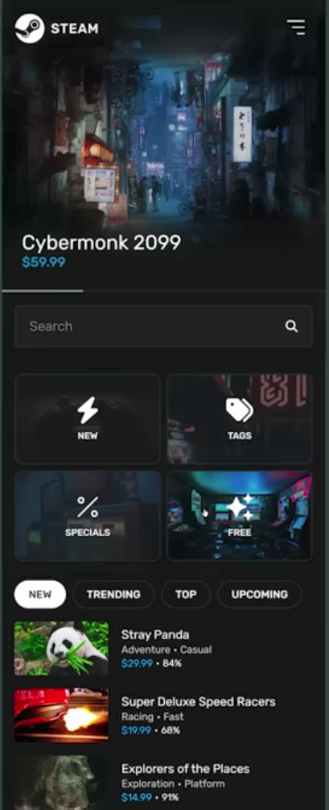
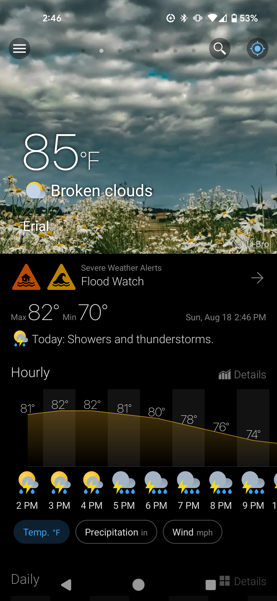
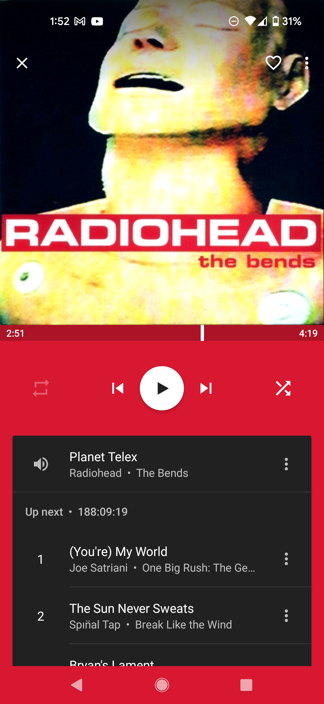
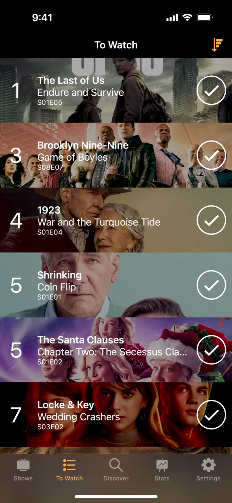
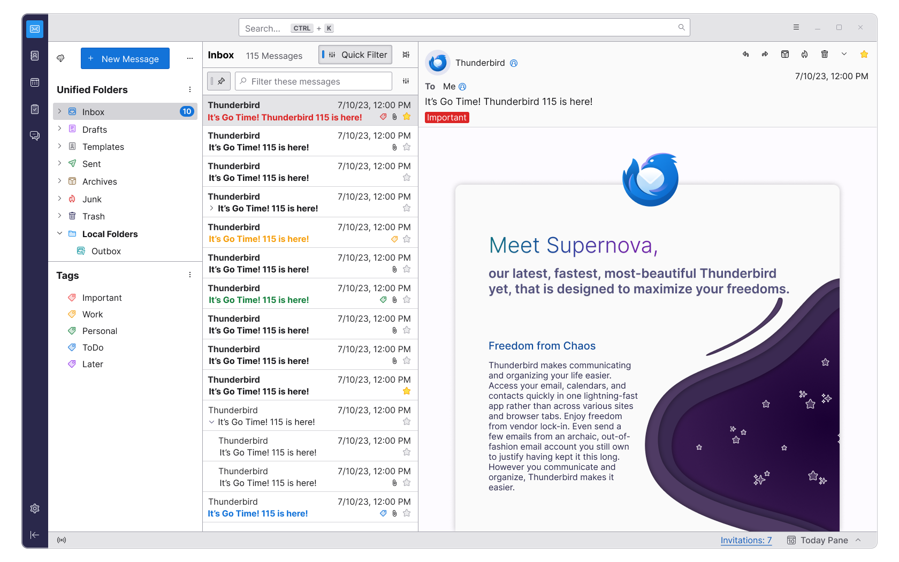
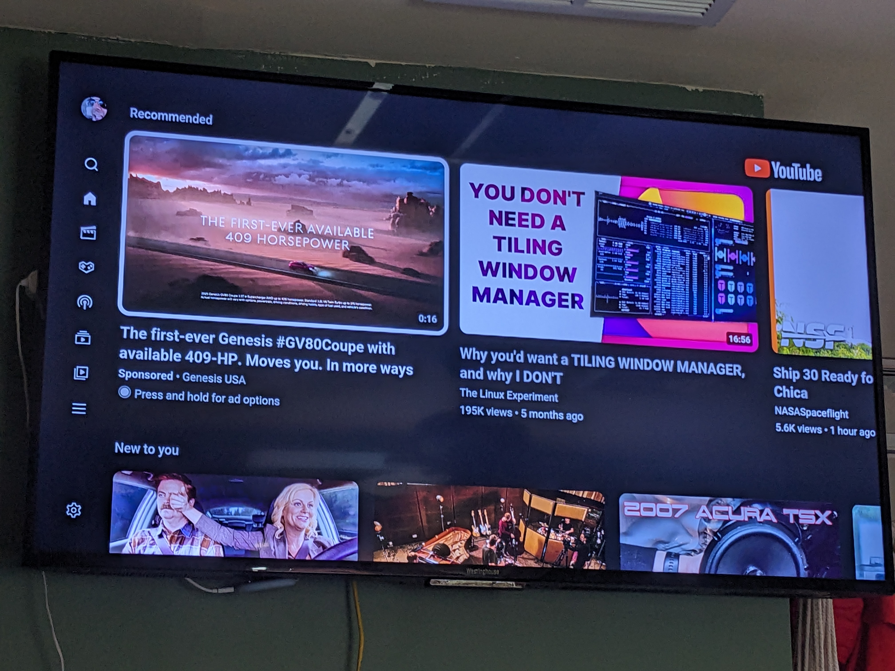

# [Amplfr.com](//amplfr.com/)

Website that plays media - audio, audio/video - files sourced from [amplfr.com](//amplfr.com/) using [Amplfr API](//amplfr.github.io/api/), other Providers, and possibly the local device.
Base HTML page (for backwards compatibility, for more browsers to be able to render), with feature detection and loading.
Uses [Service Workers](#service-worker) to make calls to API

Main page consists of [Player/Queue](#player), Search, and Body.

## Player

Uses [AmplfrQueue](#AmplfrQueue) to handle loading, playback, and queueing of multiple items (as well as albums, playlists, and other collections).
Uses GET /api/queue to pull down current list of items.
Only one item can be played at a time.
A user may add additional items, rearrange already queued items, as well as remove items.

### playing Items

- primarily cares about User's [\_QUEUE](api.md#Playlists) built-in playlist (publicly known as Playing)
  - User can enqueue/replace contents of another Playlist into [\_QUEUE](api.md#Playlists)
- any changes/additions/deletions made to User's Playlist are sent to [Playlist](api.md#Playlists) as soon as possible
  - allows User to "take his/her Playing playlist with him/her", easily switch Clients/Devices
  - updates can be "pushed" to devices that User is signed into (upon next use)
- Player lists at least 2 recommended Items to enqueue/play-next to encourage User to keep playing
- each recommended Item's options are:
  - play now
  - play next in [\_QUEUE](api.md#Playlists)
  - append to [\_QUEUE](api.md#Playlists) (default)
  - not now (dismiss recommended Item and get another recommendation)
  - not ever (dismiss recommended Item and get another recommendation)

### prefetch next Items in [\_QUEUE](api.md#Playlists)

- Service Worker keeps Queue synchronized with Service
- Service Worker downloads Items in Queue
  - downloads at least the beginning of Item(s) that User _may_ play for smooth playback

## Search

- Sends and presents search queries to POST /api/search.
- Presents the returned results
- Lists suggested searches and available filters.
- Does basic validation (as possible) before submission
- (\#MAYBE) Use available OpenAPI documents to list available filters/options (and their valid ranges) as well as help with validation
- Presented as a panel that may be hidden and revealed when needed

## Body

Presents recommended/suggested albums, items.

Comprised of Amplfr Web Components that are dynamically added after initial page load (using HTMX)

## Elements

Every section of Amplfr.com is broken up into its Element, comprising the backing service and the Web Component to render the received JSON from that service.

- AmplfrItem

  ```html
  <amplfr-item src="https://amplfr.com/kREnNawsJqg7PFfX3LYqEy/Just">
    Just
    <artist>Radiohead</artist>
    <album>The Bends</album>
  </amplfr-item>
  ```

- AmplfrCollection
  ```html
  <!-- prettier-ignore -->
  <amplfr-collection src="//amplfr.com/album/ssJLoBpTnHbb4ojwjDLKYt/(What's+the+Story)+Morning+Glory?">
    
    (What's the Story) Morning Glory?
    <released>1995-10-02</released>
    <artist>Oasis</artist>
    <item src="//amplfr.com/pLR8y92byj7cycE3UUYTi8/Hello">Hello</item>
    <item src="//amplfr.com/p3tSa8CY7NoGwx3uzp23sd/Roll+With+It">Roll With It</item>
    <item src="//amplfr.com/4MZY5TrtyK9XMgSyh51KFk/Wonderwall">Wonderwall</item>
    <item src="//amplfr.com/undefined">Don’t Look Back in Anger</item>
    <item src="//amplfr.com/76FGzRC35hZd9nHaaowZ8X/Hey+Now!">Hey Now!</item>
    <item src="//amplfr.com/7v7mWRZuj6iHENvgHbAQeh/Some+Might+Say">Some Might Say</item>
    <item src="//amplfr.com/65V8XCk735iotDfYEE6LTK/Cast+No+Shadow">Cast No Shadow</item>
    <item src="//amplfr.com/undefined">She’s Electric</item>
    <item src="//amplfr.com/xjdz242YiH8XkH4mmBojTF/Morning+Glory">Morning Glory</item>
    <item src="//amplfr.com/czsVRaDCo95YC5DpgXLm6t/Champagne+Supernova">Champagne Supernova</item>
  </amplfr-collection>
  ```

Each Web Component can be rendered/styled as one of the following:

- Tile
  - Small "square" comprised of the artwork, title, and artist(s)
  - think movie poster, album cover, book cover, etc. with title
- Banner
  - Small "rectangle" comprised of the artwork, title, and artist(s)
  - artwork on the left, with title, artist(s) on the right
- Pane
  - Large parcel
  - an Item Pane is a large/fullscreen media Player for this Item
    - artwork, title, artist information fades out
  - a Collection Pane is comprised of the artwork, title, and artist(s), as well as related metadata
    - Wikipedia blurb
    - related

Every Web Component fetches its basic data from its service, regardless of how it is to be rendered.

### AmplfrSearch

Web Component

### AmplfrItem

Web Component (Javascript class) that takes a media URL and creates everything needed to play it back.

\#Maybe extends `audio` HTML tag (HTMLAudioElement class)

- handles

  - parses given ID or URL, and fetches and loads necessary content into [Shadow DOM](https://developer.mozilla.org/en-US/docs/Web/API/Web_components/Using_shadow_DOM)
  - internal style'ing
  - adjusts to fill container

    ```html
    <amplfr-audio src="//amplfr.com/kREnNawsJqg7PFfX3LYqEy/Just"></amplfr-audio>
    ~~~<amplfr-audio data-id="kREnNawsJqg7PFfX3LYqEy"></amplfr-audio>~~~
    ```

- actions

  - parse ID or URL (onload)

    - fetches and loads necessary metadata

      - Title
      - Artist(s)
      - Albumart or poster

    - determines appropriate AmplfrMedia handler and loads it

  - setup media
  - play/pause

  - buttons and links for additional actions

    - add more Items, Collections, etc.

  - buttons and links for additional metadata, which opens in target "\_amplfr"
    - share
    - save

- todo

  - [ ] [other providers](notes.md#Other_Providers)
  - [ ] add to AmplfrQueue function and control
  - [x] scale everything based on container size and not whole document dimensions
  - [ ] pull out non-core functionality into modules as appropriate
    - [x] minify JS files into a single minified file using [terser](https://github.com/terser/terser)
  - [x] basic (yet correct) [jsdoc](https://github.com/jsdoc/jsdoc) in code document generation
  - [ ] separate playing from displaying, so it can be display only with ability to "upgrade" to playing

  -

### AmplfrAudio

Web Component (Javascript class) that encapsulates audio media functions, with focus on loading media from Provider. Non-special methods, properties are inherited.

- minimum methods:
  - fastSeek()
  - load()
    - decode from ID
    - load media
  - pause()
  - play()

### AmplfrVideo

Web Component (Javascript class) that encapsulates video media functions, with focus on loading media from Provider. Non-special methods, properties are inherited.

- minimum methods:
  - fastSeek()
  - load()
    - decode from ID
    - load media
  - pause()
  - play()

### Play.html

Webpage plays a single file via AmplfrItem
[Rhapsody in Blue test](https://amplfr.com/play?title=Rhapsody%20in%20Blue&artist=George%20Gershwin&artwork=/test/Rhapsody_in_Blue_cover.jpg&src=/test/US_Marine_Band_Rhapsody_in_Blue.oga)

- handles
  - [ ] passes given URL
  - [ ] cast controls - navigator.mediaSession
  - [ ] whats next/related

### AmplfrCollection

Javascript class that extends AmplfrItem class to handle multiple AmplfrItems in a (immutable) Collection
A Collection can be:

- an Album - a static list of Items
- an Artist - a (unique) set of Items all by the same Artist
- a Playlist - a list of Items added/edited by its Owning User
- a Portfolio - a (unique) set of Items
- a Channel - an in-order set of Items, with possibility of additional Items added over time

- handles

  - previous
  - next
  - shuffle
  - [share target](https://web.dev/web-share-target/)
  - changing current item
  - (get) length - number of items
  - current - gets/sets current item
  - contains(itemID) - returns true if item is in Collection

- todo
  - [ ] migrate appropriate features from Queue
    - [ ] cast controls - navigator.mediaSession
  - [ ] add to AmplfrQueue function and control
  - [ ] separate playing from displaying, so it can be display only with ability to "upgrade" to playing

### AmplfrQueue

Javascript class that extends AmplfrCollection class to allow a modifiable collection

- handles

  - adding additional AmplfrItems, AmplfrCollections
    - What's Next option
    - drag and drop
  - can rearrange Items
  - includes Filters to order and distill what to play now
  - can display User's history
  - includes search bar and filters

- todo
  - [ ] migrate appropriate features from Queue
  - [ ] everything else

## design/layout

Design/layout needs to intelligently incorporaate [Player](#player), [Search](#search), and [Body](#body), all using [Elements](#elements) for mobile, PC, and large format (TV) devices.

incorporate ideas from this [YouTube UI redesign video](https://www.youtube.com/watch?v=OUM6XmhViN4) ([Figma](https://www.figma.com/community/file/1450380484645543336/youtube-redesign) [YouTube Redesign – Figma](https://www.figma.com/community/file/1450380484645543336/youtube-redesign))

- tags along the top to specify what is included in Home
  - user can filter which tags are included/excluded
- side navigation buttons
  - Home
  -

### item layout

#### wide rectangle

- artwork on the left with title, artist, album/Collection, time text to the right
- playing icon/button over the arwork and progress bar below title and above artist and album/Collection text
- 
- 
- 
- 

- 

#### large square

- (large square) artwork as background with title, artist, album/Collection text (each on its own line)
  - similar to how music video data was presented on MTV

### small screen (mobile) layout

vertical orientation, toggling between Body/Search and Player/Queue

- Body
  - similar to Steam.com redesign
    - carousel of "hero" images at the top
    - large square tiles for sections
    - list of rectangle tiles
    - 
  - large artwork transitions from large square to wide tile - similar to [Weawow Android app](https://weawow.com/)
    - 
  - TODO need to figure out the buttons for the bottom bar
- Player similar to [Phonograph Android app](https://github.com/kabouzeid/Phonograph)'s layout
  - Player has large artwork displayed
  - list of upcoming tracks (Queue) is visibile and can be maximized and then scrolled
  - Player minimized to bar down at the bottom of the screen while Body is displayed
  -  
- Queue
  - white text over artwork image
  - similar to 

### large screen layout

widescreen orientation
Queue and Body can be displayed simulateously, side-by-side

(collapsable) Queue (with Player at the top) on the left side and Body/Search to the right

- Queue
  - can collapse with just the next 5 (or so) items being visible as well as a Add to Queue button at the bottom of it
  - mouseover (temporarily) expands the Queue - peek
  - other buttons/icons for other sections below the Queue
  - Slack app's left gutter 
  - Mozilla Thunderbird 
  - YouTube app 
- Player
  - header bar at the top, where it intersects with the Queue on the left
  - includes Search button that shows when active
  - logo on the right top corner
- Body

## PWA

Uses Progressive Web App (PWA) features (see [this doc](https://web.dev/app-like-pwas/)) to provide enhanced abilities, such as:

- [offline content available](https://web.dev/app-like-pwas/#offline-content-available-and-media-playable)
- [State synchronized over the cloud](https://web.dev/app-like-pwas/#state-synchronized-over-the-cloud)
- [quick actions in context menu](https://web.dev/app-like-pwas/#quick-actions-in-context-menu) via [app shortcuts](https://web.dev/app-shortcuts/)
- [content surfaced outside of app](https://web.dev/app-like-pwas/#content-surfaced-outside-of-app)
- [Lock screen media control widget](https://web.dev/app-like-pwas/#lock-screen-media-control-widget) with the [Media Session API](https://web.dev/media-session/)
- [sharing with other applications](https://web.dev/app-like-pwas/#sharing-to-and-interacting-with-other-applications)

  - see [js/sharing.js]()
  - allows User to share to another App (especially Android, maybe iOS)
  - use [internal URL shortner](#shortner) using first 6 characters of ID and the whole Title/Name

    | Shortened URL                                 | Actual URL                                              |
    | --------------------------------------------- | ------------------------------------------------------- |
    | https://amplfr.com/aUrL68/Fix+You             | https://amplfr.com/aUrL68afopDCZH7m32qnrE/Fix+You       |
    | https://ampl.fr/@user/wWXnqZ/Monkey+Wrench    | https://amplfr.com/wWXnqZ4ieknmWq2wUWb8oP/Monkey+Wrench |
    | https://amplfr.com/@user/wWXnqZ/Monkey+Wrench | https://amplfr.com/wWXnqZ4ieknmWq2wUWb8oP/Monkey+Wrench |
    | https://user@amplfr.com/wWXnqZ/Monkey+Wrench  | https://amplfr.com/wWXnqZ4ieknmWq2wUWb8oP/Monkey+Wrench |

  - use [QR Code-svg](https://github.com/datalog/qrcode-svg) to generate on screen QR code for the share URL
  - include Queue's items in the URL (hash) ([source](https://www.scottantipa.com/store-app-state-in-urls))
    - can safely use up to ~2083 characters in a URL, so up to about 90 IDs
    - can compress longer hash URLs with [pieroxy/lz-string](https://github.com/pieroxy/lz-string).compress() and Base64.encode() (also decompress)
      ```javascript
      const stateString = JSON.stringify(appState); // appState is a json object
      const compressed = compress(stateString); // using lz-string's compress
      const encoded = Base64.encode(compressed);
      // Push that `encoded` string to the url - specifically to window.location.hash
      // ... Later, on page load or on undo/redo we read the url and
      // do the following
      const decoded = Base64.decode(encoded); // same encoded as above, but read from url
      const uncompressed = uncompress(decoded);
      const newState = JSON.parse(uncompressed);
      // Now load your application with the newState
      ```
    - URL hash is decompressed and then each ID is fetched
    - Any addition/removal of an item causes the window.history to be updated
      - get free undo/redo with the browser's back/forward buttons
      - map Ctrl-Z/Shift-Ctrl-Z to window.history's .back()/.forward()
    - current item is currently selected, with the following item IDs following in the URL

- Media sources

  - plays media from Amplfr.com using [Content-Stream](api.md#Content-Stream)/[Content-Torrent](api.md#Content-Torrent) for Content Item data
    - default option to stream dynamically, based on speed, congestion, etc.
    - allow User to force high-definition stream
      - User is willing to wait up-front in exchange for better quality
      - probably need to be a premium $ add-on
    - handles playing Advertisements as appropriate
  - uses other [Amplfr API](api.md) services
    - [Metadata](api.md#Metadata) to provide additional info about the Items
    - [Recognition](api.md#Recognition) to identify what is playing
    - [Recommendation](api.md#Recommendation) to suggest additional Items
    - [Playlist](api.md#Playlists) to handle Playlist management, especially [\_QUEUE](api.md#Playlists_QUEUE)
  - plays media from [other Providers](#Other_Providers)
    - User has to have an active account with the Other Provider to be able to playback from that Provider
  - plays media from [local device](#local_media_playback)

### Service Worker

Service Worker (SW, probably sw.js) handles most of the needed processing to enable PWA features

### link capturing/caching

SW intercepts URL requests - e.g., via fetch() - to fulfill from cache, based on the location and desired strategy.

TODO

- [ ] setup initial sw.js
- [ ] setup basic caching for page elements
  - CSS, Javascript, etc. files
  - probably use [Stale while revalidate](https://developer.chrome.com/docs/workbox/caching-strategies-overview/#stale-while-revalidate)
- [ ] setup to [serve cached audio and video](https://developer.chrome.com/docs/workbox/serving-cached-audio-and-video/)
  - for media files
  - use [ExpirationPlugin](https://developer.chrome.com/docs/workbox/caching-resources-during-runtime/#setting-an-expiry-for-cache-entries) to evict more than `maxEntries` so as to not fill up the storage
- [ ] setup separate cache for images
  - image files
  - probably use [Stale while revalidate](https://developer.chrome.com/docs/workbox/caching-strategies-overview/#stale-while-revalidate)
  - use [ExpirationPlugin](https://developer.chrome.com/docs/workbox/caching-resources-during-runtime/#setting-an-expiry-for-cache-entries) to evict more than `maxEntries` so as to not fill up the storage
- [ ] make SW installable

- SW cache strategies:
  - Network first, falling back to cache
    - images
      - /img/\*
    - \*\*.js
    - \*\*.css
    - fonts
    - static \*.json
  - Cache first, falling back to network
    - media files
    - try to keep at least some of these as [persistant storage](https://web.dev/persistent-storage/)
  - Stale while revalidate
    - /api/\*/\*.json
      - /**ID**.json
      - /artist/**ID**.json
      - /album/**ID**.json
      - /channel/**ID**.json
      - /playlist/**ID**.json
      - /portfolio/**ID**.json
      - /search/**ID**.json
    - /api/queue

intercepts all links and checks cache first for any requests including:

- //amplfr.com
  - /api
    - /**ID**
    - /artist/**ID**
    - /album/**ID**
    - /channel/**ID**
    - /playlist/**ID**
    - /portfolio/**ID**
    - /search/**ID**
  - /me
  - /my
  - /img
- //amplfr.net
  - /img

### background sync

Use [background sync](https://developer.chrome.com/blog/background-sync/) to update Queue and playback changes/updates. The updates will be sent when the user has connectivity - which is immediate if user already has connectivity. Registering for a sync using the same tag as a pending sync causes it to coalesce with the existing sync.

## features

- Player Playing.ended actions - a per-Item action that occurs after that Item finishes playing (its 'ended' event)

  - play next Item (default)
  - stop playing
  - repeat/loop (indefinitely)
  - repeat/loop N times

- Player end of list (EOL) Options - a list of 4/+ recommended options that User wants Player to do at the end of the current Playlist instead of just stopping

  - uses [Recommendation](api.md#Recommendation) to suggest additional Similar Items
  - Random - something different, but same tempo/beat/feel

- Player Pause-at-next-break - when selected, Player will pause at the next natural break in the presentation (or at the end of the Item playing)

  - any Ads won't be presented until play is resumed
  - Player will continue to buffer, etc. as needed

- [7 Ways to Make Netflix SO MUCH BETTER](http://www.collegehumor.com/post/7011319/7-options-that-would-make-netflix-even-better) #todo

  - ask if they're still there in-between item playback not during (or at least at decent breaks)
  - incognito-mode or hide/remove played items from history
  - alternative audio tracks (ie director's commentary, other language)
  - group Items into [Playlists](api.md#Playlists) (ordered), [Portfolios](api.md#Portfolios) (unordered), [Channels](api.md#Feeds) (scheduled)
  - integration with Twitter, Facebook, etc. - share an Item, [Playlist](api.md#Playlists), [Portfolio](api.md#Portfolios), [Channel](api.md#Feeds)
  - random option - plays a favorite (ie "Play something I like") or suggested item

### maybe

- idle detection

  - see [js/idle-detection.js]()
  - fires when the device (phone/tablet) hasn't moved for some time
  - could be useful for showing a notification that Player will stop playing after this item, or in X minutes

- bluetooth connectivity

  - see [js/bluetooth.js]()
  - could be used to match heartrate to song tempo (BPM)

- file system

  - see [js/file-system.js]()
  - could be used to save (purchased) downloaded file
  - could be used to read a song, "fingerprint it", and then upload the fingerprint for identification

- Google Play Billing

  - see [Use Play Billing in your Trusted Web Activity - Chrome Developers](https://developer.chrome.com/docs/android/trusted-web-activity/play-billing/)
  - 30% fee

- Party/Guest/DJ Mode
  - a Playlist where others can add Songs (like requesting songs from a DJ at a party)
  - how it works
    1. a User sets a (new or existing) Playlist so others can add
       - the Playlist is set to Shared
       - this User is considered the Owner of this Playlist
       - User can either share the actual URL or a QR code of the URL for the Playlist
    2. other Users access this Playlist, and can add Items to play
    3. the Owning User can remove or skip songs
  - if the Playlist is being played via Chromecast (or similar), the QR code can be displayed in the corner of the display for others to add songs, and see the songlist

### serve locally (dev)

```bash
npx serve -p 8080   # no SSL

# with SSL FIXME
openssl req -x509 -newkey rsa:4096 -days 365 -keyout ca-key.pem -out ca-cert.pem    # use same pass phrase
openssl rsa -in ca-key.pem -out ca-key-nopass.pem    # use same pass phrase
npx serve -p 8080 --ssl-cert ca-cert.pem --ssl-key ca-key-nopass.pem    # without pass phrase
```

```bash
pandoc --standalone --metadata title="Amplfr.com" -c ~/.pandoc/github-markdown.css -f gfm -t html README.md > README.html
```
