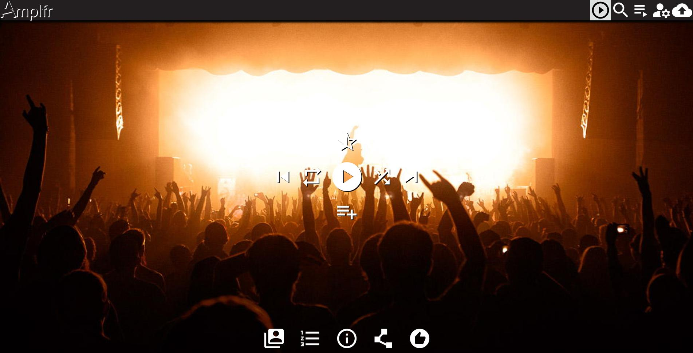
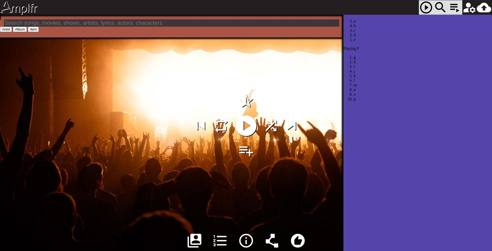
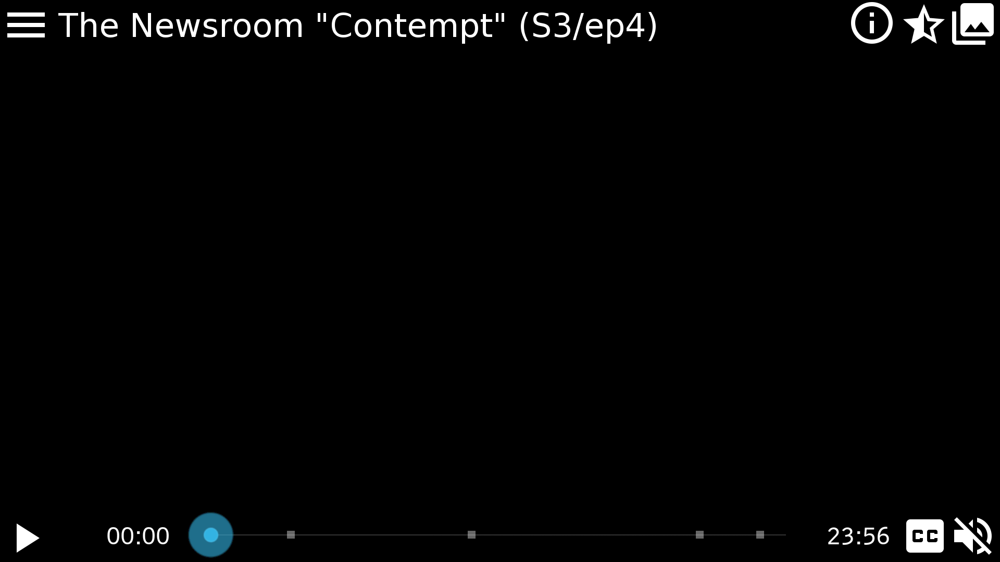

# [Amplfr.com](//amplfr.com/)

Website that plays media - audio, audio/video - files sourced from [amplfr.com](//amplfr.com/) using [Amplfr API](//amplfr.github.io/api/), other Providers, and possibly the local device.

- Uses <abbr title="Progressive Web App">PWA</abbr> features (see [this doc](https://web.dev/app-like-pwas/)) to provide enhanced abilities, such as:

  - running offline
  - [offline content available](https://web.dev/app-like-pwas/#offline-content-available-and-media-playable)
  - [State synchronized over the cloud](https://web.dev/app-like-pwas/#state-synchronized-over-the-cloud)
  - [quick actions in context menu](https://web.dev/app-like-pwas/#quick-actions-in-context-menu) via [app shortcuts](https://web.dev/app-shortcuts/)
  - [content surfaced outside of app](https://web.dev/app-like-pwas/#content-surfaced-outside-of-app)
  - [Lock screen media control widget](https://web.dev/app-like-pwas/#lock-screen-media-control-widget) with the [Media Session API](https://web.dev/media-session/)
  - [sharing with other applications](https://web.dev/app-like-pwas/#sharing-to-and-interacting-with-other-applications)

- Media sources

  - plays media from Amplfr.com using [Content-Stream](api.md#Content-Stream)/[Content-Torrent](api.md#Content-Torrent) for Content Item data
    - default option to stream dynamically, based on speed, congestion, etc.
    - allow User to force high-definition stream
      - User is willing to wait up-front in exchange for better quality
      - probably need to be a premium $ add-on
    - handles playing Advertisements as appropriate
  - uses other [Amplfr API](api.md) services
    - [Metadata](api.md#Metadata) to provide additional info about the Items
    - [Recognition](api.md#Recognition) to identify what is playing
    - [Recommendation](api.md#Recommendation) to suggest additional Items
    - [Playlist](api.md#Playlists) to handle Playlist management, especially [\_QUEUE](api.md#Playlists_QUEUE)
  - plays media from [other Providers](#Other_Providers)
    - User has to have an active account with the Other Provider to be able to playback from that Provider
  - plays media from [local device](#local_media_playback)

## features

- End-of-List (EOL) Options - a list of 4/+ recommended options that User wants Player to do at the end of the current Playlist instead of just stopping

  - uses [Recommendation](api.md#Recommendation) to suggest additional Similar Items
  - Random - something different, but same tempo/beat/feel

- Pause-at-next-break - when selected, Player will pause at the next natural break in the presentation (or at the end of the Item playing)

  - any Ads won't be presented until play is resumed
  - Player will continue to buffer, etc. as needed

- [7 Ways to Make Netflix SO MUCH BETTER](http://www.collegehumor.com/post/7011319/7-options-that-would-make-netflix-even-better) #todo

  - ask if they're still there in-between item playback not during (or at least at decent breaks)
  - incognito-mode or hide/remove played items from history
  - alternative audio tracks (ie director's commentary, other language)
  - group Items into [Playlists](api.md#Playlists) (ordered), [Portfolios](api.md#Portfolios) (unordered), [Channels](api.md#Feeds) (scheduled)
  - integration with Twitter, Facebook, etc. - share an Item, [Playlist](api.md#Playlists), [Portfolio](api.md#Portfolios), [Channel](api.md#Feeds)
  - random option - plays a favorite (ie "Play something I like") or suggested item

- Party/Guest/DJ Mode
  - a Playlist where others can add Songs (like requesting songs from a DJ at a party)
  - how it works
    1. a User sets a (new or existing) Playlist so others can add
       - the Playlist is set to Shared
       - this User is considered the Owner of this Playlist
       - User can either share the actual URL or a QR code of the URL for the Playlist
    2. other Users access this Playlist, and can add Items to play
    3. the Owning User can remove or skip songs
  - if the Playlist is being played via Chromecast (or similar), the QR code can be displayed in the corner of the display for others to add songs, and see the songlist

## playing Items

- primarily cares about User's [\_QUEUE](api.md#Playlists) built-in playlist (publicly known as Playing)
  - User can enqueue/replace contents of another Playlist into [\_QUEUE](api.md#Playlists)
- any changes/additions/deletions made to User's Playlist are sent to [Playlist](api.md#Playlists) as soon as possible
  - allows User to "take his/her Playing playlist with him/her", easily switch Clients/Devices
- Player lists at least 2 recommended Items to enqueue/play-next to encourage User to keep playing
- each recommended Item's options are:
  - play now
  - play next in [\_QUEUE](api.md#Playlists)
  - append to [\_QUEUE](api.md#Playlists) (default)
  - not now (dismiss recommended Item and get another recommendation)
  - not ever (dismiss recommended Item and get another recommendation)

## prefetch next Items in [\_QUEUE](api.md#Playlists)

- Service Worker keeps Queue synchronized with Service
- Service Worker downloads Items in Queue
  - downloads at least the beginning of Item(s) that User _may_ play for smooth playback

## <abbr title="User Interface">UI</abbr>

- uses a simple video canvas (or image) with more advanced abilities can be hidden/revealed
  - different panel on each edge
  - \#SHOULD have a quick overview of the different panels on first use
- respects device's [platform look and feel](https://web.dev/app-like-pwas/#platform-look-and-feel)
  - [dark mode](https://github.com/GoogleChromeLabs/dark-mode-toggle)
  - [system-ui](https://developer.mozilla.org/docs/Web/CSS/font-family#%3Cgeneric-name%3E:~:text=system%2Dui,-Glyphs) value for the [font-family](https://developer.mozilla.org/docs/Web/CSS/font-family)
  - uses the [user-select](https://developer.mozilla.org/docs/Web/CSS/user-select) CSS property with the value of <u>none</u>, you can protect UI elements from being accidentally selected

### layout

- 
- 
- 

- 
- 

- all panels slide away to respective edge

- List on right side (a tab for each)
  - [Playlist](api.md#Playlists) contents
  - at least 2 recommended Items (suggested by [Recommendation](api.md#Recommendation) service)
- Controls/Progress on bottom (or top)
  - use thin progress bar/slider combo; elapsed time can be used to enter specific time
- What's Playing on top
  - Title, artist, collection, etc
- search and information overlay
  - reduced opacity (for videos) panel displays additional information on what's playing
  - User can hide/show
  - same idea as [Amazon X-Ray](http://www.wired.com/2015/04/amazon-xray-fire-tv/)
- canvas is resizable; will change resolution as appropriate
- for audio (ie songs), canvas can be used for visualization
  - [Oscilloscope Art](https://www.youtube.com/watch?v=ytnt9l_WKxk)
    - use functioning oscilloscope as audio visualization

### gestures

- uses gestures to rate Items (only with a list; never during playback)

  - short swipe right
    - dislike current Item, play next Item
  - long swipe right
    - never play current Item again, play next Item
  - short swipe left
    - like current Item, play next Item
  - long swipe right
  - shake
    - shuffle
  - long press on Play/Pause
    - Pause-at-next-break

### Android

- [Android Slice](https://developer.android.com/guide/slices/) provider
  - [example project](https://github.com/novoda/spikes/tree/master/sliceanddice)
    > Slices are UI templates that can display rich, dynamic, and interactive content from your app from within the Google Search app and later in other places like the Google Assistant. Slices can help users perform tasks faster by enabling engagement outside of the fullscreen app experience. You can build Slices as enhancements to [App Actions](https://developer.android.com/guide/actions/).

### Chromecast support

- [third-party link](http://www.programmableweb.com/api/google-chromecast)

### locally cache Items

- allow App to cache Items when able/allowed

  - \#probably only for paying Users
  - App will default to native quality (ie resolution) for cacheing, but User may override
    - maybe lower quality to fit more in same space
      > As with streaming, customers can select different video qualities that use more or less data. Downloading shows will use about the same amount of data as streaming, but the ability to store video could help customers better manage their data usage by downloading shows on home Wi-Fi networks to avoid using cellular data.
  - maybe allow scheduling downloads
    > Satellite users often have very restrictive monthly data caps but are given unlimited data for a few hours in the middle of the night. We could see a Netflix user downloading shows during those hours when the connection is unmetered, but Netflix's new download feature isn't completely ideal for that scenario. Netflix did not mention any plans for scheduling downloads or bringing downloads to devices besides iPhones, iPads, and Android phones and tablets. A startup called Aterlo Networks we [wrote about last year](http://arstechnica.com/information-technology/2015/09/netflix-nightshift-caches-shows-on-your-home-network-to-boost-speed/) solves that problem by letting customers schedule recordings for the middle of the night and cache them locally so they can be viewed on any device connected to a home Wi-Fi network.

- notes

  - [Netflix's new offline mode lets you download shows, watch them offline | Ars Technica](http://arstechnica.com/information-technology/2016/11/netflixs-new-offline-mode-lets-you-download-shows-watch-them-offline/)

- \#maybe download an Item and store it locally
  - \#todo is the Item encrypted? does it have to be?
  - \#todo is this only available to a User with a Subscription?
- User can play locally-stored Item anytime
  - App periodically does a light check-in with the Service
    - to ensure the Item is still available
    - stores permission (and maybe a key) to unlock the Item
- User can share locally-stored Item anytime
  - Sending App asks the Service if the Item is still available
  - Receiving App asks the Service for permission (and maybe a key) to unlock the Item on the new device
- option to minimize data usage

  - Service will maximize compression in communication with User's Device
  - faster/smaller download, longer/processing time
  - User informed that loading might take a little longer

- [YouTube Go Is an App Made for the Next Billion Users | WIRED](https://www.wired.com/2016/09/youtube-reinvented-next-billion-users/) - YouTube Go, and it represents more than a year of work to rethink YouTube for a new kind of user

  > The so-called "next billion" Internet users are coming online, many of them in India, Indonesia, Brazil, and China. They aren't like the users who came before. They have different devices, different connectivity, different social norms, different ideas about what the Internet is.

  > The research team found that every experience, even with technology, is inherently social. The next billion team started calling this the Human Information Network. "I have a phone, I have an individual experience," Jain says. "When we move to these societies, it's very social, it's very integrated. How do we respond to that?"
  > The team spent months talking to individual users, or sitting down with small groups to figure out how they use apps together. There was the guy in a one-room house who couldn't wait to show Johanna Wright, YouTube's VP of product management, his favorite WWE wrestling videos but couldn't get them to load fast enough. Or the guy who got videos from a brother-in-law who worked in a bakery with decent Wi-Fi. He'd download videos at work, then use the Shareit app to send them to his friends and family. The YouTubers saw more languages than they expected, more varied use cases for the Internet, and an entirely different way of sharing content. People didn't discover videos on Twitter, they found them by swapping SD cards or sharing directly with their friends.

  > Ultimately, the next billion team came up with a handful of core principles for a new YouTube experience. They focused on making the app work even on even the cheapest phones, enabling sharing between people, localizing the app as much as possible, and maximizing data-friendliness. That last one was the hardest, because it meant the app had to work offline far beyond just letting you download videos (though you can of course download videos). Data is expensive, and connectivity can be hard to come by. Many people keep data off, except when they need it. "I can honestly say, after being in India," says Arvind Srinivasan, the team's engineering director, "that the 2G in our office is fantastic." For YouTube, that meant the app had to feel alive even without a connection. YouTube Go compresses and caches thumbnails for videos so you can poke around and see what's there. You can see, share, and watch videos without ever pinging a cellphone tower.

  > Because it's designed to operate offline, YouTube Go's sharing also is an almost entirely local experience. Once you've downloaded a video, it sits on your phone like any other file. In the YouTube Go app, you go to a sharing menu, and it shows you who's around waiting to receive a video. Tap their name and the video and the app sends it over a local Wi-Fi network. The app does a light check-in with the YouTube server to credit the creator (and ensure the video's not deleted), and unlocks the video on the new device. In theory, one person could download a long video and share it with everyone on Earth, one by one, without ever having to download the entire file again.

### check User's IP address to see if registered to ISP that uses metered usage vs unlimited

- [ ] \#todo check User's IP address to see if registered to ISP that is known to use metered usage vs unlimited
- ask User to confirm or change Service's guesstimate
- provide link to Settings so User can update

### do-not-disturb option

- probably only available in native app
- only turns off ringer (ie notification sounds); leaves vibration other notifications alone
- turns off after preset time - ie 1 hour
  - User turns option on and must select how long until option times out and re-enables ringer
- _shouldn't_ interfere with alarms, notifications, screen light-up, etc.
- MUST ensure that ringer is re-enabled after powerloss
- will _silently_ notify User that "notification sounds will be re-enabled in 5 minutes" 5 minutes before timer expires
  - User can
- options:
  - off
  - 10 minutes
  - 30 minutes (default)
  - 1 hour
  - custom duration (then User can enter how long in hours:minutes)
  - specific time (then User specifies the time to re-enable ringer)

### [WebTorrent](https://github.com/feross/webtorrent)

- BitTorrent-based sharing as an option (opt-in)
- WebSockets-based BitTorrent client
- demo - [https://webtorrent.io/](webtorrent.io)
- [Readme doc](https://github.com/feross/webtorrent/blob/master/README.md) ([local Readme](webtorrent/README.md))
- [simple player webpage](./webtorrent.io/index.html)
- works, but brings whole system to a crawl
  - \#todo set maximum number of WebSocket connections to (2 \* navigator.hardwareConcurrency)
    - eg. client = new WebTorrent( maxConns: (2 \* navigator.hardwareConcurrency), dht: FALSE )
  - \#maybe liberal application of JavaScript 'debouce' functions [JavaScript Debounce Function](https://davidwalsh.name/javascript-debounce-function) could help to throttle performance
- \#maybe User receives small credit for each MB that they upload
- possible sharing (sending) settings (in App):
  - don't send or receive from others- off
  - receive, but don't send data to others
  - stop sharing after downloadeding hits 100% (default)
  - wifi-only
  - wifi and mobile network
    - gives warning that this may incur charges
- starts with 2 Service Workers (each handles both seeding and downloading)
  - runs performance diagnostic before running as a baseline measurement
  - re-runs performance diagnostic periodically before adding/removing SWs
    - very conservative in adding SWs, very liberal in removing them
- prefer "closer" peers
- [ ] test streaming w/ Webtorrent (from peers and Server) vs direct from Server

### [webtorrent-googlecast](https://github.com/FluorescentHallucinogen/webtorrent-googlecast) (WTGC)

- use to case WebTorrent videos to [Google Cast](https://g.co/cast) devices
- demo - [https://wtgc.firebaseapp.com/](https://wtgc.firebaseapp.com/)
- \#todo combine functionality of WTGC's _receiver.htm_ with ability receive Cast of normal streamed content
- \#todo modify WTGC's _receiver.htm_ to not playback until "enough" pieces are downloaded for smooth playback
  - use receiver's video events - either _canplay_ or _canplaythrough_ - to trigger playback start
- \#todo have receiver send sender's IP address as a client
  - "...[using a] custom receiver, you can simply send the ip address from your sender to your receiver using either the customData that is available on a number of existing API calls or use a custom channel/namespace to do it." [note](https://stackoverflow.com/questions/33052185/is-there-a-way-to-retrieve-the-ip-address-of-a-sender)
  ```
  torrent.addPeer(_IP address_)
  ```
- \#todo modify WTGC's _receiver.htm_ to prioritize requesting "next" pieces
  ```
  torrent.critical(start, end)
  ```
- \#todo modify _sender.htm_ and _receiver.htm_ to use a queue to load-up/read URLs to play
- [Readme](webtorrent-googlecast/README.md)

### notes

- [Google Won't Build a Desktop Music Player, So These Guys Did | WIRED](http://www.wired.com/2016/05/google-play-music-desktop-radiant-player-gpmdp/)

- [Got unlimited data? Netflix now lets you get the highest quality on mobile | Ars Technica](http://arstechnica.com/business/2016/05/netflix-now-lets-customers-increase-video-quality-on-cellular-networks/)
  - allow User to decide ceiling of how much data to use

## frontend

- [ ] Queue playlist side panel
  - [x] slides in/out
  - [ ] handles swipe to hide/show ([possible starting point](https://stackoverflow.com/a/49200411))
- [ ] Search top panel
  - [x] slides in/out
  - [ ] handles swipe to hide/show
  - [x] handles searches
    - [x] separate Artist/Album/Item queries
    - [ ] unified search across Artist/Album/Item API endpoints
  - [ ] results as tiles (specific to type, i.e., Artist result --> Artist tile)
  - [ ] add Tags that can be selected to filter results
    - [ ] duration ranges
    - [ ] genre
    - [ ] BPM (beats per minute)/tempo ranges
- [ ] use skeleton loading animation for tiles ([code](https://github.com/WebDevSimplified/skeleton-loading), [video](https://www.youtube.com/watch?v=ZVug65gW-fc))
- [ ] animate loading of various elements ([video](https://www.youtube.com/watch?v=nJ81DFmgHdU&t=0s), [codepen](https://codepen.io/WebDevSimplified/pen/PoYXzPp))
  - [ ] centered logo moves to corner (like Gmail's logo/loading animation)
- [ ] tiles
  - [x] basic design
  - [ ] implement Song tile
  - [ ] implement Artist tile
  - [ ] implement Album tile
- [ ] implement basic Player
  - [ ] use playing Item's albumart as background
  - [ ] hide all Player controls after timeout and show on click/tap/mousemove
    - make the logo transparent (like broadcast TV stations)
  - [x] implement theater mode (hide all elements except Player background and controls)
- [ ] handle Rating gestures
  - [ ] click/tap heart/star to like
  - [ ] long click/tap heart/star to select rating (how many hearts/stars)
  - [ ] drag down to dislike and skip
  - [ ] drag down and left to dislike, skip and never play again (trash can)

## internals (under the hood)

- use various API endpoints
  - [ ] /api/playlist/\_queue.json - Queue'ed Items
  - [ ] /api/history.json - History
  - [ ] /api/{album|artist|song}/**ID**.json - Album/Artist/Song lookup
  - [ ] /api/{album|artist|song}.json - Album/Artist/Song search
    - [ ] /api/search.json - unified Album/Artist/Song/etc. search
  - [ ] /img/{album|artist}art/**ID**.jpg - Album/Artist artwork
- [ ] [workbox]() for Service Worker/caching capabilities
- [ ] [workbox-background-sync](https://developer.chrome.com/docs/workbox/modules/workbox-background-sync/) for queued updates/feedback back to various APIs
  - send back User updates for Playlists (especially Queue)
  - send back Playing progress updates
- [ ] precache initial 10s/10% of queued up Items
  - [ ] [workbox-range-request](https://developer.chrome.com/docs/workbox/modules/workbox-range-request/)
- [ ] cache list of results into individual responses - artist/1, artist/2, etc.
- [ ] Queue can handle content from other Providers
- [ ] Player determines what MIME/media type(s) Client can play
  - [ ] call <code>audioOrVideo.[canPlayType](https://developer.mozilla.org/en-US/docs/Web/API/HTMLMediaElement/canPlayType)(mediaType)</code> function early in Player.onload() to generate list for media Requests

## Other Providers

Player can play content from other Providers (given that User has authenticated with other Provider as necessary)

- possible Providers

  - [ ] [Apple Music (MusicKit JS)](https://developer.apple.com/documentation/musickitjs)
  - [ ] Spotify ([web api](https://developer.spotify.com/web-api/)) maybe using [spotify-web-api-js](https://github.com/JMPerez/spotify-web-api-js)
  - [ ] YouTube Music via [ytmusicapi](https://ytmusicapi.readthedocs.io/en/latest/)
  - [ ] media files from [Google Drive](https://developers.google.com/drive/api/v3/quickstart/js)
  - [ ] SoundCloud
  - [ ] local media files via [](https://github.com/GoogleChromeLabs/browser-fs-access) (fallback for [File System Access API](https://web.dev/browser-fs-access/#the-file-system-access-api))

- [ ] write a Provider class to handle particulars for each Provider

  ```javascript
  class AbstractProvider {
      constructor()   // setup for Service, including authentication
      destructor()    //

      authenticate()  // handles signing in User

      // list Tracks, Albums, Artists
      list()

      play()
      pause()
      stop()

  }
  ```

## local media playback

- browser will need to support [File System Access API](https://web.dev/file-system-access/) (or the [browser-fs-access](https://github.com/GoogleChromeLabs/browser-fs-access) shim) and can play the media type for the selected files
- also use [music-metadata-browser](https://github.com/Borewit/music-metadata-browser) to extract metadata

  ```javascript
  const browserfs = require("browser-fs-access");
  const metadata = require("music-metadata-browser");
  const blobs = await browserfs.directoryOpen({ recursive: true });

  blobs.forEach(async (blob) => {
    const { common, format } = await metadata.parseBlob(blob);
    const i = {
      title: common.title,
      artists: common.artists || common.artist,
      duration: format.duration,
      bitrate: format.bitrate,
      mimetype: blob.type + format.codec ? `; ${format.codec}` : "",
      isrc: common.isrc,
      mbid: common.musicbrainz_recordingid,
      // url: URL.createObjectURL(blob),
      blob,
    };
    // if (format.codec) i.mimetype += `; ${format.codec}`
    // TODO save i
    items.push(i);
  });

  audio.src = thisItem.url || URL.createObjectURL(thisItem.blob);
  ```

- store a list of the known files on the local device in [IndexedDB](https://developer.mozilla.org/docs/Web/API/IndexedDB_API) (using a promise wrapper like [idb](https://www.npmjs.com/package/idb))
- \#MAYBE may only be able to play local files at one time, with the User having to re-authorize to access local files each time

Music (media) player webpage

http://localhost:8081/api/playlist/UTKtg53PKSDe3h5XMrx64x.json --> playlist/UTKtg53PKSDe3h5XMrx64x

- references:
  - Watch the full [PWA tutorial](https://fireship.io/lessons/pwa-top-features/) on YouTube.
  - Build a basic [PWA in 100 Seconds](https://youtu.be/sFsRylCQblw)

## features

### eventually

- idle detection

  - see [app/idle-detection.js]()
  - fires when the device (phone/tablet) hasn't moved for some time
  - could be useful for showing a notification that Player will stop playing after this item, or in X minutes

- sharing

  - see [app/sharing.js]()
  - allows User to share to another App (especially Android, maybe iOS)
  - use [internal URL shortner](#shortner) using first 5-6 characters of ID and the whole Title/Name

    | Shortened URL                       | Actual URL                                              |
    | ----------------------------------- | ------------------------------------------------------- |
    | https://ampl.fr/aUrL6/Fix+You       | https://amplfr.com/aUrL68afopDCZH7m32qnrE/Fix+You       |
    | https://ampl.fr/wWXnq/Monkey+Wrench | https://amplfr.com/wWXnqZ4ieknmWq2wUWb8oP/Monkey+Wrench |

### maybe

- bluetooth connectivity

  - see [app/bluetooth.js]()
  - could be used to match heartrate to song tempo (BPM)

- file system

  - see [app/file-system.js]()
  - could be used to save (purchased) downloaded file
  - could be used to read a song, "fingerprint it", and then upload the fingerprint for identification

- Google Play Billing
  - see [Use Play Billing in your Trusted Web Activity - Chrome Developers](https://developer.chrome.com/docs/android/trusted-web-activity/play-billing/)
  - 30% fee

## functions

### generate manifest.json's icons

### serve locally (dev)

```bash
npx serve -p 8080   # no SSL

# with SSL FIXME
openssl req -x509 -newkey rsa:4096 -days 365 -keyout ca-key.pem -out ca-cert.pem    # use same pass phrase
openssl rsa -in ca-key.pem -out ca-key-nopass.pem    # use same pass phrase
npx serve -p 8080 --ssl-cert ca-cert.pem --ssl-key ca-key-nopass.pem    # without pass phrase
```

```bash
npx pwa-asset-generator ./img/icon.svg ./img -i ./index.html -m ./manifest.json --favicon
```
