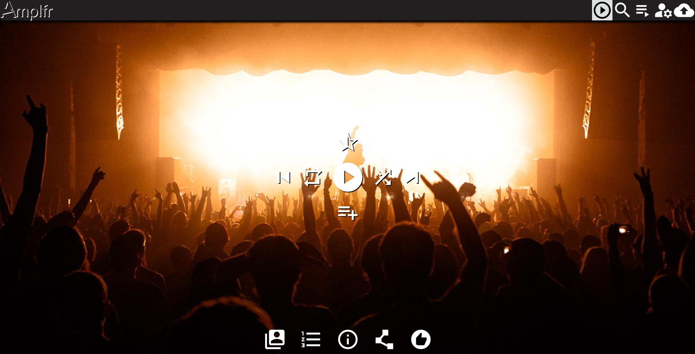
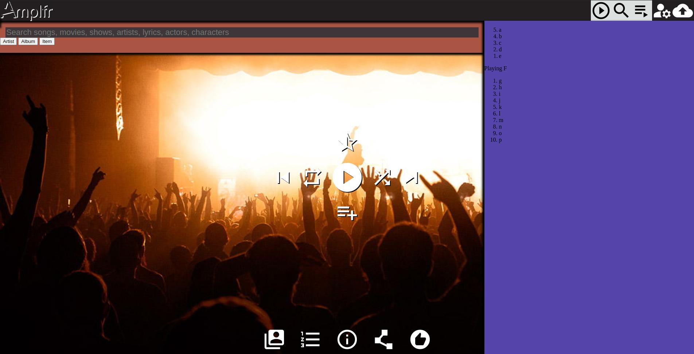
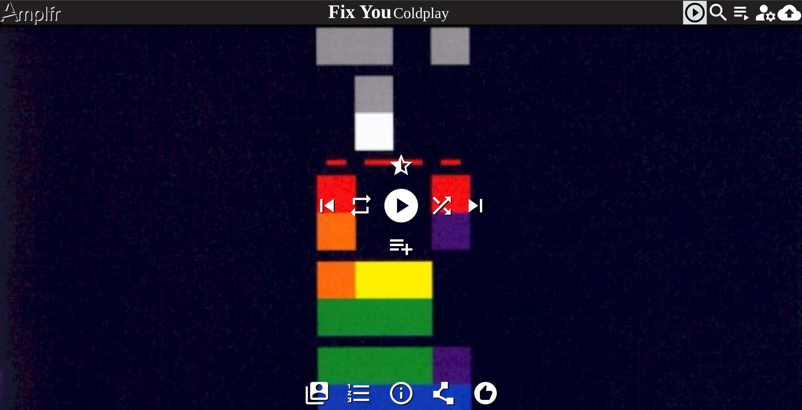
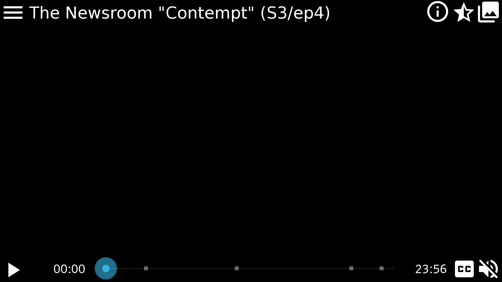
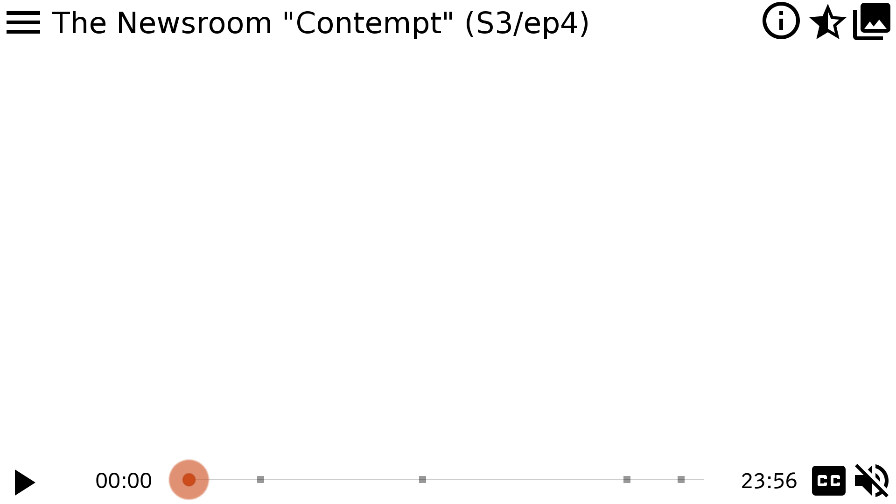

## EntryObj

Any Container that has a list of items and/or additional related data fields - Item - Artist - Album - Playlist - Portfolio - Channel - search list

data cached as Key=Value of **_container type_/_ID_** = JSON (entries ['items' key] and additional related fields)
the key is the URL of the Entry, but in its most compressed form removing all redundant text
e.g, `//amplfr.com/api/playlist/UTKtg53PKSDe3h5XMrx64x/Matt+to+Kim` --> 'playlist/UTKtg53PKSDe3h5XMrx64x'
each entry in 'items' key is cached as its own Entry

```
>Amplfr
```

## local file access - MAYBE

User's device has program that securely reports the audio/video files on it

- only User can access these files
- User sets one (possibly multiple) directory/folder that contains the audio/video files to report
- User can select specific directories/folders and/or specific files to ignore

User can opt to either torrent the reported files, or just report them

### Crossover Proxy

A local program that securely scans and serves local audio/video files for access only by User

- like [Cloudflare Argo Tunnel](https://blog.cloudflare.com/argo-tunnel/) (source: [cloudflared](https://github.com/cloudflare/cloudflared)) for Amplfr

- User runs program on device (prefereably as Service)
  - uses a secure outgoing port to Amplfr
- User authenticates via browser if not done so already
  - maybe using OAuth
- User specifies root location(s) to scan from, with option to ignore specified files/locations
- scans for local audio/video files
- newly discovered files are reported to Service
- these files are either/both:
  - securely served from same device
  - securely Torrented, with Amplfr serving as a proxy
- Amplfr may serve known requested files from its Service instead of User's device

#### Requirements:

- needs to scan for audio/video files under specified directories/folders, ignoring those selected to ignore
- needs to gather the information and upload it securely
- needs to scan for updates periodically
  - could probably use something like Linux's fnotify to report updates
  - could run at most every 60 minutes
- only needs to scan for and upload the changes - does not make any changes to these files
  - only needs to write to a local database or flat file
- uploaded data is encrypted and specific to this User
- scan should include
  - hash
    - fast over secure/unique, so maybe FNV-1a
    - don't care about duplicates on a single device
  - file location
  - MIME type
    - audio/\* and video/\* only
    - maybe playlist files as well - .m3u, .m3u8, etc.
  - title
  - artist(s)
  - duration

#### Design

- NodeJS program
  - executable using [pkg](https://www.npmjs.com/package/pkg) or maybe [nexe](https://www.npmjs.com/package/nexe)
- use Express for serving files
  - limit number of files being served to max of 4
- sends POST to Amplfr
  - Owner's UserID
  - list of files (in location-filename alphabetic order)
    - checksum
    - title (and other extracted metadata)
    - relative location and filename
- sends occassional PING to Amplfr
  - Merkle tree of files
    - made up of location-filename alphabetic order of checksums
  - timestamp
  - IP address

#### Options

- use BitTorrent to serve the discovered audio/video files
  - only Users who own a particular file may download/stream it
  - benefits
    - optimizes access to files also hosted by others
  - drawbacks
    - could irritate User's ISP
- scan and upload files not seen before
  - Service serves files without need for User's device to be online
  - benefits
    - uploads minimal amount of data
  - drawbacks
    - most Users will have compressed copies with a range of quality

User has program that runs at startup which scans their device for audio/video files

## Metadata

/**Itemid**.**ext** --> /**Itemid**?just**ext**=1

- treat any unrecognized extension as a JSON field to return just the value of, redirecting to
- rename some "extensions" as necessary:
  - /api/**Itemid**.albums --> /api/album?item=**Itemid**
  - /api/**Itemid**.albumart --> /api/album.jpg?item=**Itemid**&offset=0&number=1
  - /api/**Itemid**.files --> //amplfr.net/**Itemid**.json
  - /api/album/**Albumid**.jpg --> //amplfr.net/img/albumart/**Albumid**.front
  - /api/artist/**Artistid**.jpg --> //amplfr.net/img/artistart/**Artistid**.jpg
  - /api/artist/**Artistid**.twitter --> /api/artist/**Artistid**?links=twitter.com
  - /api/artist/**Artistid**.wiki --> /api/artist/**Artistid**?links=wikidata.org

## Security.txt

[security.txt](https://securitytxt.org/) is an accepted standard for website security information that allows security researchers to report security vulnerabilities easily.[1] The standard prescribes a text file called security.txt in the well known location, similar in syntax to robots.txt but intended to be machine- and human-readable, for those wishing to contact a website's owner about security issues. ([Wikipedia](https://en.wikipedia.org/wiki/Security.txt))

Located at [/security.txt](https://amplfr.com/security.txt) for Amplfr.com

```bash
cat >security.txt <<EOF
Contact: mailto:security@amplfr.com
Preferred-Languages: en
Canonical: https://amplfr.com/security.txt
EOF
Expires: 2023-12-01T05:00:00.000Z
Encryption: https://amplfr.com/publickey.txt
Acknowledgments: https://amplfr.com/acknowledgments.html
Policy: https://amplfr.com/security-policy.html

# generate key for Amplfr Security
gpg --generate-key

export GNUPGHOME="$(mktemp -d)"
cat >foo <<EOF
    %echo Generating a basic OpenPGP key
    Key-Type: RSA
    Key-Length: 4096
    Name-Real: Amplfr Security
    Name-Email: security@amplfr.com
    %pubring publickey.txt
    # Do a commit here, so that we can later print "done" :-)
    %commit
    %echo done
EOF
    # Subkey-Curve: ed25519
    # Subkey-Usage: sign
    # Subkey-Curve: cv25519
    # Subkey-Usage: encrypt
gpg --batch --generate-key foo


gpg --batch --generate-key  <<EOF
    %echo Generating a basic OpenPGP key
    Key-Type: RSA
    Key-Length: 4096
    Name-Real: Amplfr Security
    Name-Email: security@amplfr.com
    %pubring publickey.txt
    # Do a commit here, so that we can later print "DONE" :-)
    %commit
    %echo DONE
EOF

gpg --armor --export security@amplfr.com

gpg --list-secret-keys

export GNUPGHOME="$(mktemp -d)"
new_key_name="Amplfr Security <security@amplfr.com>"
gpg --personal-digest-preferences "SHA512" --quick-generate-key "${new_key_name}" rsa4096 cert 0

new_key_fingerprint=$(if [[ $(gpg --list-keys "${new_key_name}") =~ ([A-F0-9]{40}) ]]; then echo ${BASH_REMATCH[1]}; fi)
if [ -n "${new_key_fingerprint}" ]; then
  # generate elyptic curve encryption sub-key with no expiration
  gpg --quick-add-key ${new_key_fingerprint} cv25519 encr 0

  # generate ed25519 authentication sub-key with no expiration
  gpg --quick-add-key ${new_key_fingerprint} ed25519 auth 0

  # generate ed25519 signing sub-key with no expiration
  gpg --quick-add-key ${new_key_fingerprint} ed25519 sign 0
fi
gpg --armor --export security@amplfr.com | tee ./publickey.txt
gpg --personal-digest-preferences "SHA512" --clearsign security.txt
mv security.txt.asc security.txt
```

## User Interface (UI)

- uses a simple video canvas (or image) with more advanced abilities can be hidden/revealed
  - different panel on each edge
  - \#SHOULD have a quick overview of the different panels on first use
- respects device's [platform look and feel](https://web.dev/app-like-pwas/#platform-look-and-feel)
  - [dark mode](https://github.com/GoogleChromeLabs/dark-mode-toggle)
  - [system-ui](https://developer.mozilla.org/docs/Web/CSS/font-family#%3Cgeneric-name%3E:~:text=system%2Dui,-Glyphs) value for the [font-family](https://developer.mozilla.org/docs/Web/CSS/font-family)
  - uses the [user-select](https://developer.mozilla.org/docs/Web/CSS/user-select) CSS property with the value of <u>none</u>, you can protect UI elements from being accidentally selected

### layout

- 
- 
- 

- 
- 

- all panels slide away to respective edge

- List on right side (a tab for each)
  - [Playlist](api.md#Playlists) contents
  - at least 2 recommended Items (suggested by [Recommendation](api.md#Recommendation) service)
- Controls/Progress on bottom (or top)
  - use thin progress bar/slider combo; elapsed time can be used to enter specific time
- What's Playing on top
  - Title, artist, collection, etc
- search and information overlay
  - reduced opacity (for videos) panel displays additional information on what's playing
  - User can hide/show
  - same idea as [Amazon X-Ray](http://www.wired.com/2015/04/amazon-xray-fire-tv/)
- canvas is resizable; will change resolution as appropriate
- for audio (ie songs), canvas can be used for visualization
  - [Oscilloscope Art](https://www.youtube.com/watch?v=ytnt9l_WKxk)
    - use functioning oscilloscope as audio visualization

### gestures

- uses gestures to rate Items (only with a list; never during playback)

  - short swipe right
    - dislike current Item, play next Item
  - long swipe right
    - never play current Item again, play next Item
  - short swipe left
    - like current Item, play next Item
  - long swipe right
  - shake
    - shuffle
  - long press on Play/Pause
    - Pause-at-next-break

### Android

- [Android Slice](https://developer.android.com/guide/slices/) provider
  - [example project](https://github.com/novoda/spikes/tree/master/sliceanddice)
    > Slices are UI templates that can display rich, dynamic, and interactive content from your app from within the Google Search app and later in other places like the Google Assistant. Slices can help users perform tasks faster by enabling engagement outside of the fullscreen app experience. You can build Slices as enhancements to [App Actions](https://developer.android.com/guide/actions/).

### Chromecast support

- [third-party link](http://www.programmableweb.com/api/google-chromecast)

### locally cache Items

- allow App to cache Items when able/allowed

  - \#probably only for paying Users
  - App will default to native quality (ie resolution) for cacheing, but User may override
    - maybe lower quality to fit more in same space
      > As with streaming, customers can select different video qualities that use more or less data. Downloading shows will use about the same amount of data as streaming, but the ability to store video could help customers better manage their data usage by downloading shows on home Wi-Fi networks to avoid using cellular data.
  - maybe allow scheduling downloads
    > Satellite users often have very restrictive monthly data caps but are given unlimited data for a few hours in the middle of the night. We could see a Netflix user downloading shows during those hours when the connection is unmetered, but Netflix's new download feature isn't completely ideal for that scenario. Netflix did not mention any plans for scheduling downloads or bringing downloads to devices besides iPhones, iPads, and Android phones and tablets. A startup called Aterlo Networks we [wrote about last year](http://arstechnica.com/information-technology/2015/09/netflix-nightshift-caches-shows-on-your-home-network-to-boost-speed/) solves that problem by letting customers schedule recordings for the middle of the night and cache them locally so they can be viewed on any device connected to a home Wi-Fi network.

- notes

- Amplfr

  - [Amplfr.com](https://www.amplfr.com/)
  - [>Amplfr - loading 'Rhapsody in Blue'](https://www.amplfr.com/play?title=Rhapsody%20in%20Blue&artist=George%20Gershwin&artwork=/test/Rhapsody_in_Blue_cover.jpg&src=/test/US_Marine_Band_Rhapsody_in_Blue.oga)
  - [Amplfr.com](https://192.168.1.200:8080/)

  - [MDwiki](http://raspberrypi.local/Dropbox/Minoraudio/index.html#!amplfr.md)
  - [MDwiki](http://raspberrypi.local/Dropbox/Minoraudio/index.html#!amplfr.com/notes.md)
  - [Amplfr API](http://raspberrypi.local/Dropbox/Minoraudio/api.html#/)
  - [MDwiki](http://raspberrypi.local/Dropbox/Minoraudio/index.html#!./metadata/README.md)

- [terser/terser: 🗜 JavaScript parser, mangler and compressor toolkit for ES6+](https://github.com/terser/terser)
- [andstor/jsdoc-action: GitHub Action to build JSDoc documentation](https://github.com/andstor/jsdoc-action)
  - [tmont/audio-metadata: Extracts meta data from various audio containers](https://github.com/tmont/audio-metadata)

* [172.17.0.2](http://172.17.0.2:9000/#!/1/docker/containers)
* [Moises App: The Musician's App | Vocal Remover & much more | Moises App](https://moises.ai/)

* [Default Cache Behavior · Cloudflare Cache docs](https://developers.cloudflare.com/cache/about/default-cache-behavior)
* [Adding JSON Feed to your site](https://perchrunway.com/blog/2017-06-07-adding-json-feed-to-your-site)
* [JSON Feed - JSON Feed Version 1](https://www.jsonfeed.org/version/1/)
* [Google Search gets modernized weather card on desktop - 9to5Google](https://9to5google.com/2021/02/22/google-search-weather-desktop/)
* [Media RSS Specification](https://www.rssboard.org/media-rss)
* [shields/server-secrets.md at master · badges/shields](https://github.com/badges/shields/blob/master/doc/server-secrets.md#github)
* [Personal Access Tokens (Classic)](https://github.com/settings/tokens)
* [Edit fiddle - JSFiddle - Code Playground](https://jsfiddle.net/jongobar/sNKWK/)
* [server parts - Google Sheets](https://docs.google.com/spreadsheets/d/1QYcsYLRbK18UCLJAL9QZVlQbVuIH8MeWkPQv5kXoU-s/edit?pli=1#gid=0)

* [WebDevSimplified/Drag-And-Drop](https://github.com/WebDevSimplified/Drag-And-Drop)

- marquee effect

  - [How to Add the Marquee Effect without Using the Marquee Tag](https://www.w3docs.com/snippets/css/how-to-have-the-marquee-effect-without-using-the-marquee-tag-with-css-javascript-and-jquery.html#example-of-creating-a-horizontally-scrolling-text-without-the-lt-marquee-gt-tag-6)
  - [Marquee using CSS3 keyframe animation](https://codepen.io/jamesbarnett/pen/kQebQO)
  - [How to determine the content of HTML elements overflow or not ? - GeeksforGeeks](https://www.geeksforgeeks.org/how-to-determine-the-content-of-html-elements-overflow-or-not/#)

- PWA
  - [Building a PWA Music Player Part 1: File System API - DEV Community 👩‍💻👨‍💻](https://dev.to/ndesmic/building-a-pwa-music-player-part-1-file-system-api-4nf6)
  - [elegantapp/pwa-asset-generator: Automates PWA asset generation and image declaration. Automatically generates icon and splash screen images, favicons and mstile images. Updates manifest.json and index.html files with the generated images according to Web App Manifest specs and Apple Human Interface guidelines.](https://github.com/elegantapp/pwa-asset-generator)
  - [Make your PWA feel more like an app](https://web.dev/app-like-pwas/#capable-of-running-offline)
- YouTube
  - [YouTube Player API Reference for iframe Embeds  |  YouTube IFrame Player API  |  Google Developers](https://developers.google.com/youtube/iframe_api_reference)
  - [Videos: list  |  YouTube Data API  |  Google Developers](https://developers.google.com/youtube/v3/docs/videos/list?apix=true&apix_params=%7B%22part%22%3A%5B%22player%22%5D%2C%22id%22%3A%5B%22jszFKG9zVs4%22%5D%2C%22access_token%22%3A%22AIzaSyAO_FJ2SlqU8Q4STEHLGCilw_Y9_11qcW8%22%7D)
  - [google api - get_video_info YouTube endpoint suddenly returning 404 not found - Stack Overflow](https://stackoverflow.com/questions/67615278/get-video-info-youtube-endpoint-suddenly-returning-404-not-found)
  - [LuanRT/YouTube.js: 🎥 full-featured wrapper around YouTube's private API — reverse engineering InnerTube](https://github.com/LuanRT/YouTube.js)

* [>Amplfr - loading 'Rhapsody in Blue'](https://www.amplfr.com/play?title=Rhapsody%20in%20Blue&artist=George%20Gershwin&artwork=/test/Rhapsody_in_Blue_cover.jpg&src=/test/US_Marine_Band_Rhapsody_in_Blue.oga)

- Amplfr Github

  - [upload-pages-artifact/action.yml at main · actions/upload-pages-artifact](https://github.com/actions/upload-pages-artifact/blob/main/action.yml)
  - [configure-pages/action.yml at main · actions/configure-pages](https://github.com/actions/configure-pages/blob/main/action.yml)
  - [Need help publishing to github pages from a GitHub Actions workflow · Discussion #41627 · community](https://github.com/orgs/community/discussions/41627)
  - [https://raw.githubusercontent.com/actions/starter-workflows/main/pages/hugo.yml](https://raw.githubusercontent.com/actions/starter-workflows/main/pages/hugo.yml)
  - [Configuring a publishing source for your GitHub Pages site - GitHub Docs](https://docs.github.com/en/pages/getting-started-with-github-pages/configuring-a-publishing-source-for-your-github-pages-site#creating-a-custom-github-actions-workflow-to-publish-your-site)
  - [Deploying static sites to GitHub Pages using GitHub Actions | by Daniel Jimenez Garcia | Medium](https://medium.com/@danieljimgarcia/publishing-static-sites-to-github-pages-using-github-actions-8040f57dfeaf)

  * [Netflix's new offline mode lets you download shows, watch them offline | Ars Technica](http://arstechnica.com/information-technology/2016/11/netflixs-new-offline-mode-lets-you-download-shows-watch-them-offline/)

- \#maybe download an Item and store it locally
  - \#todo is the Item encrypted? does it have to be?
  - \#todo is this only available to a User with a Subscription?
- User can play locally-stored Item anytime
  - App periodically does a light check-in with the Service
    - to ensure the Item is still available
    - stores permission (and maybe a key) to unlock the Item
- User can share locally-stored Item anytime
  - Sending App asks the Service if the Item is still available
  - Receiving App asks the Service for permission (and maybe a key) to unlock the Item on the new device
- option to minimize data usage

  - Service will maximize compression in communication with User's Device
  - faster/smaller download, longer/processing time
  - User informed that loading might take a little longer

- [YouTube Go Is an App Made for the Next Billion Users | WIRED](https://www.wired.com/2016/09/youtube-reinvented-next-billion-users/) - YouTube Go, and it represents more than a year of work to rethink YouTube for a new kind of user

  > The so-called "next billion" Internet users are coming online, many of them in India, Indonesia, Brazil, and China. They aren't like the users who came before. They have different devices, different connectivity, different social norms, different ideas about what the Internet is.

  > The research team found that every experience, even with technology, is inherently social. The next billion team started calling this the Human Information Network. "I have a phone, I have an individual experience," Jain says. "When we move to these societies, it's very social, it's very integrated. How do we respond to that?"
  > The team spent months talking to individual users, or sitting down with small groups to figure out how they use apps together. There was the guy in a one-room house who couldn't wait to show Johanna Wright, YouTube's VP of product management, his favorite WWE wrestling videos but couldn't get them to load fast enough. Or the guy who got videos from a brother-in-law who worked in a bakery with decent Wi-Fi. He'd download videos at work, then use the Shareit app to send them to his friends and family. The YouTubers saw more languages than they expected, more varied use cases for the Internet, and an entirely different way of sharing content. People didn't discover videos on Twitter, they found them by swapping SD cards or sharing directly with their friends.

  > Ultimately, the next billion team came up with a handful of core principles for a new YouTube experience. They focused on making the app work even on even the cheapest phones, enabling sharing between people, localizing the app as much as possible, and maximizing data-friendliness. That last one was the hardest, because it meant the app had to work offline far beyond just letting you download videos (though you can of course download videos). Data is expensive, and connectivity can be hard to come by. Many people keep data off, except when they need it. "I can honestly say, after being in India," says Arvind Srinivasan, the team's engineering director, "that the 2G in our office is fantastic." For YouTube, that meant the app had to feel alive even without a connection. YouTube Go compresses and caches thumbnails for videos so you can poke around and see what's there. You can see, share, and watch videos without ever pinging a cellphone tower.

  > Because it's designed to operate offline, YouTube Go's sharing also is an almost entirely local experience. Once you've downloaded a video, it sits on your phone like any other file. In the YouTube Go app, you go to a sharing menu, and it shows you who's around waiting to receive a video. Tap their name and the video and the app sends it over a local Wi-Fi network. The app does a light check-in with the YouTube server to credit the creator (and ensure the video's not deleted), and unlocks the video on the new device. In theory, one person could download a long video and share it with everyone on Earth, one by one, without ever having to download the entire file again.

### check User's IP address to see if registered to ISP that uses metered usage vs unlimited

- [ ] \#todo check User's IP address to see if registered to ISP that is known to use metered usage vs unlimited
- ask User to confirm or change Service's guesstimate
- provide link to Settings so User can update

### do-not-disturb option

- probably only available in native app
- only turns off ringer (ie notification sounds); leaves vibration other notifications alone
- turns off after preset time - ie 1 hour
  - User turns option on and must select how long until option times out and re-enables ringer
- _shouldn't_ interfere with alarms, notifications, screen light-up, etc.
- MUST ensure that ringer is re-enabled after powerloss
- will _silently_ notify User that "notification sounds will be re-enabled in 5 minutes" 5 minutes before timer expires
  - User can
- options:
  - off
  - 10 minutes
  - 30 minutes (default)
  - 1 hour
  - custom duration (then User can enter how long in hours:minutes)
  - specific time (then User specifies the time to re-enable ringer)

### WebTorrent

- [WebTorrent](https://github.com/feross/webtorrent)
- BitTorrent-based sharing as an option (opt-in)
- WebSockets-based BitTorrent client
- demo - [https://webtorrent.io/](webtorrent.io)
- [Readme doc](https://github.com/feross/webtorrent/blob/master/README.md) ([local Readme](webtorrent/README.md))
- [simple player webpage](./webtorrent.io/index.html)
- works, but brings whole system to a crawl
  - \#todo set maximum number of WebSocket connections to (2 \* navigator.hardwareConcurrency)
    - eg. client = new WebTorrent( maxConns: (2 \* navigator.hardwareConcurrency), dht: FALSE )
  - \#maybe liberal application of JavaScript 'debouce' functions [JavaScript Debounce Function](https://davidwalsh.name/javascript-debounce-function) could help to throttle performance
- \#maybe User receives small credit for each MB that they upload
- possible sharing (sending) settings (in App):
  - don't send or receive from others- off
  - receive, but don't send data to others
  - stop sharing after downloadeding hits 100% (default)
  - wifi-only
  - wifi and mobile network
    - gives warning that this may incur charges
- starts with 2 Service Workers (each handles both seeding and downloading)
  - runs performance diagnostic before running as a baseline measurement
  - re-runs performance diagnostic periodically before adding/removing SWs
    - very conservative in adding SWs, very liberal in removing them
- prefer "closer" peers
- [ ] test streaming w/ Webtorrent (from peers and Server) vs direct from Server

### [webtorrent-googlecast](https://github.com/FluorescentHallucinogen/webtorrent-googlecast) (WTGC)

- use to case WebTorrent videos to [Google Cast](https://g.co/cast) devices
- demo - [https://wtgc.firebaseapp.com/](https://wtgc.firebaseapp.com/)
- \#todo combine functionality of WTGC's _receiver.htm_ with ability receive Cast of normal streamed content
- \#todo modify WTGC's _receiver.htm_ to not playback until "enough" pieces are downloaded for smooth playback
  - use receiver's video events - either _canplay_ or _canplaythrough_ - to trigger playback start
- \#todo have receiver send sender's IP address as a client
  - "...[using a] custom receiver, you can simply send the ip address from your sender to your receiver using either the customData that is available on a number of existing API calls or use a custom channel/namespace to do it." [note](https://stackoverflow.com/questions/33052185/is-there-a-way-to-retrieve-the-ip-address-of-a-sender)
  ```
  torrent.addPeer(_IP address_)
  ```
- \#todo modify WTGC's _receiver.htm_ to prioritize requesting "next" pieces
  ```
  torrent.critical(start, end)
  ```
- \#todo modify _sender.htm_ and _receiver.htm_ to use a queue to load-up/read URLs to play
- [Readme](webtorrent-googlecast/README.md)

### notes

- [Google Won't Build a Desktop Music Player, So These Guys Did | WIRED](http://www.wired.com/2016/05/google-play-music-desktop-radiant-player-gpmdp/)

- [Got unlimited data? Netflix now lets you get the highest quality on mobile | Ars Technica](http://arstechnica.com/business/2016/05/netflix-now-lets-customers-increase-video-quality-on-cellular-networks/)
  - allow User to decide ceiling of how much data to use

## frontend

- [ ] Queue playlist side panel
  - [x] slides in/out
  - [ ] handles swipe to hide/show ([possible starting point](https://stackoverflow.com/a/49200411))
- [ ] Search top panel
  - [x] slides in/out
  - [ ] handles swipe to hide/show
  - [x] handles searches
    - [x] separate Artist/Album/Item queries
    - [ ] unified search across Artist/Album/Item API endpoints
  - [ ] results as tiles (specific to type, i.e., Artist result --> Artist tile)
  - [ ] add Tags that can be selected to filter results
    - [ ] duration ranges
    - [ ] genre
    - [ ] BPM (beats per minute)/tempo ranges
- [ ] use skeleton loading animation for tiles ([code](https://github.com/WebDevSimplified/skeleton-loading), [video](https://www.youtube.com/watch?v=ZVug65gW-fc))
- [ ] animate loading of various elements ([video](https://www.youtube.com/watch?v=nJ81DFmgHdU&t=0s), [codepen](https://codepen.io/WebDevSimplified/pen/PoYXzPp))
  - [ ] centered logo moves to corner (like Gmail's logo/loading animation)
- [ ] tiles
  - [x] basic design
  - [x] implement Song tile
  - [ ] implement Artist tile
  - [x] implement Album tile
- [x] implement basic Player
  - [x] use playing Item's albumart as background
  - [ ] hide all Player controls after timeout and show on click/tap/mousemove
    - make the logo transparent (like broadcast TV stations)
  - [x] implement theater mode (hide all elements except Player background and controls)
- [ ] handle Rating gestures
  - [ ] click/tap heart/star to like
  - [ ] long click/tap heart/star to select rating (how many hearts/stars)
  - [ ] drag down to dislike and skip
  - [ ] drag down and left to dislike, skip and never play again (trash can)

## internals (under the hood)

- use various API endpoints
  - [ ] /api/playlist/\_queue.json - Queue'ed Items
  - [ ] /api/history.json - History
  - [ ] /api/{album|artist|song}/**ID**.json - Album/Artist/Song lookup
  - [ ] /api/{album|artist|song}.json - Album/Artist/Song search
    - [ ] /api/search.json - unified Album/Artist/Song/etc. search
  - [ ] /img/{album|artist}art/**ID**.jpg - Album/Artist artwork
- [ ] [workbox]() for Service Worker/caching capabilities
- [ ] [workbox-background-sync](https://developer.chrome.com/docs/workbox/modules/workbox-background-sync/) for queued updates/feedback back to various APIs
  - send back User updates for Playlists (especially Queue)
  - send back Playing progress updates
- [ ] precache initial 10s/10% of queued up Items
  - [ ] [workbox-range-request](https://developer.chrome.com/docs/workbox/modules/workbox-range-request/)
- [ ] cache list of results into individual responses - artist/1, artist/2, etc.
- [ ] Queue can handle content from other Providers
- [ ] Player determines what MIME/media type(s) Client can play
  - [ ] call <code>audioOrVideo.[canPlayType](https://developer.mozilla.org/en-US/docs/Web/API/HTMLMediaElement/canPlayType)(mediaType)</code> function early in Player.onload() to generate list for media Requests

## Native Application

Convert PWA to native app.

1. Use [Cordova](https://cordova.apache.org/) to create a wrapper for the PWA. These tools allow you to package your PWA as a native app for iOS and Android.
2. Once the wrapper is created, you can access the device’s features, such as the camera or GPS, unavailable to web apps.
3. Configure the app’s manifest file to specify the app’s start URL, icons, and other metadata used when the app is installed on a device.
4. Build the app for the desired platforms (iOS, Android) using your chosen tool.
5. Submit the generated app to the respective app stores (App Store and Play Store

[Cordova plugins](https://cordova.apache.org/plugins/)

- [apache/cordova-plugin-media](https://github.com/apache/cordova-plugin-media) provides the ability to record and play back audio files on a device
- [apache/cordova-plugin-file](https://github.com/apache/cordova-plugin-file) implements a File API (including [HTML5 File API](http://www.w3.org/TR/FileAPI/)) allowing read/write access to files residing on the device
  - read device files
- [apache/cordova-plugin-device](https://github.com/apache/cordova-plugin-device) defines a global device object, which describes the device's hardware and software
  - could be used to uniquely identify each device
- [apache/cordova-plugin-screen-orientation](https://github.com/apache/cordova-plugin-screen-orientation)
  - provides better control over screen orientation and locking the desired orientation

## Other Providers

Player can play content from other Providers (given that User has authenticated with other Provider as necessary)

- possible Providers

  - [ ] local media files
    - see [https://github.com/GoogleChromeLabs/browser-fs-access] (fallback for [File System Access API](https://web.dev/browser-fs-access/#the-file-system-access-api))
    - local device via HTML File System API (see [Building a PWA Music Player Part 1: File System API](https://dev.to/ndesmic/building-a-pwa-music-player-part-1-file-system-api-4nf6))
  - [ ] [WebTorrent](notes.md#WebTorrent)
  - [ ] [Apple Music (MusicKit JS)](https://developer.apple.com/documentation/musickitjs)
  - [ ] Spotify ([web api](https://developer.spotify.com/web-api/)) maybe using [spotify-web-api-js](https://github.com/JMPerez/spotify-web-api-js)
  - [ ] YouTube Music via [ytmusicapi](https://ytmusicapi.readthedocs.io/en/latest/)
  - [ ] YouTube
    - [YouTube Player API Reference for iframe Embeds  |  YouTube IFrame Player API  |  Google Developers](https://developers.google.com/youtube/iframe_api_reference)
    - could work with
  - [ ] media files from [Google Drive](https://developers.google.com/drive/api/v3/quickstart/js)
  - [ ] SoundCloud
  - [ ] Netflix
    - [unogsNG](https://rapidapi.com/unogs/api/unogsng) provides unofficial Netflix API
      - could be used for
        - search
        - title/episode lookup
      - "freemium" payment required
    - can use "https://www.netflix.com/watch/__netflixid__"
      - possibly as iframe
      - need to look at any CORS, etc. issues
  - [ ] media files from IPFS (Interplanetary File System)
    - convert IPFS URI to HTTP-based URL (via IPFS [subdomain](https://docs.ipfs.tech/concepts/ipfs-gateway/#subdomain) gateway)
      - `ipfs://{CID}/` to `https://{CID}.ipfs.amplfr.com/?download=false`
      - `ipfs://{CID}/` to `/ipfs/{CID}?download=false`
    - ignore non-media files, where MIME type isn't like "audio/\*" or "video/\*"
      - probably need to do an HTTP HEAD call to get the **Content-Type** header and confirm its supported before HTTP GET call

- [ ] write a Provider class to handle particulars for each Provider

  ```javascript
  class AbstractProvider {
      constructor()   // setup for Service, including authentication
      destructor()    //

      authenticate()  // handles signing in User

      // list Tracks, Albums, Artists
      list()

      play()
      pause()
      stop()

  }
  ```

### local media playback

- browser will need to support [File System Access API](https://web.dev/file-system-access/) (or the [browser-fs-access](https://github.com/GoogleChromeLabs/browser-fs-access) shim) and can play the media type for the selected files
- also use [music-metadata-browser](https://github.com/Borewit/music-metadata-browser) to extract metadata

  ```javascript
  const browserfs = require("browser-fs-access");
  const metadata = require("music-metadata-browser");
  const blobs = await browserfs.directoryOpen({ recursive: true });

  blobs.forEach(async (blob) => {
    const { common, format } = await metadata.parseBlob(blob);
    const i = {
      title: common.title,
      artists: common.artists || common.artist,
      duration: format.duration,
      bitrate: format.bitrate,
      mimetype: blob.type + format.codec ? `; ${format.codec}` : "",
      isrc: common.isrc,
      mbid: common.musicbrainz_recordingid,
      // url: URL.createObjectURL(blob),
      blob,
    };
    // if (format.codec) i.mimetype += `; ${format.codec}`
    // TODO save i
    items.push(i);
  });

  audio.src = thisItem.url || URL.createObjectURL(thisItem.blob);
  ```

### Spotifiy

- [Embeds | Spotify for Developers](https://developer.spotify.com/documentation/embeds)
  - Using the [oEmbed API](https://developer.spotify.com/documentation/embeds/tutorials/using-the-oembed-api), if your website handles links that have been shared by users.
  - [oEmbed API | Spotify for Developers](https://developer.spotify.com/documentation/embeds/reference/oembed)

### YouTube

- [YouTube Embedded Players and Player Parameters  |  YouTube IFrame Player API  |  Google for Developers](https://developers.google.com/youtube/player_parameters)

  - [Supported parameters](https://developers.google.com/youtube/player_parameters#Parameters)
    example

    1. build appropriate YouTube embed URL

       for https://youtube.com/watch?v=123123123 replace with https://youtube.com/embed/123123123
       for https://youtu.be/123123123 replace with https://youtube.com/embed/123123123

       - standard parameters
         - autoplay=0
         - controls=0
         - disablekb=1
         - enablejsapi=1
         - modestbranding=1
         - origin=https://amplfr.com
       - optional parameters
         - start=_start_ - seconds to start playback - only if _start_ is specified
         - end=_end_ - seconds from the start to stop playing - only if _end_ is specified
         - loop=_loop_ -

       ```
         https://www.youtube.com/embed/M7lc1UVf-VE?autoplay=0&controls=0&disablekb=1&enablejsapi=1&modestbranding=1&origin=https://amplfr.com
       ```

    2. create iframe object using the embed URL

       ```html
       <iframe
         id="ytplayer"
         type="text/html"
         width="640"
         height="360"
         src="https://www.youtube.com/embed/M7lc1UVf-VE?autoplay=0&origin=http://example.com"
         frameborder="0"
       ></iframe>
       ```

    3. add EventListeners since enablejsapi=1

       - events:
         - onReady
         - onStateChange
           - -1 (unstarted)
           - 0 (ended)
           - 1 (playing)
           - 2 (paused)
           - 3 (buffering)
           - 5 (video cued)
         - onError

- [Trending - Piped](https://piped.video/trending)

  - [GitHub - TeamPiped/Piped: An alternative privacy-friendly YouTube frontend which is efficient by design.](https://github.com/TeamPiped/Piped)

  - [API Documentation - Piped](https://docs.piped.video/docs/api-documentation/)

  - [Architecture - Piped](https://docs.piped.video/docs/architecture/)

    - /streams/:videoId

      ```
      https://piped.video/watch?v=LIsfMO5Jd_w
      https://pipedapi.kavin.rocks/streams/LIsfMO5Jd_w
      ```

    - /comments/:videoId

    - /trending

    - /channel/:channelId

      ```
      https://pipedapi.kavin.rocks/channel/UCz97F7dMxBNOfGYu3rx8aCw
      ```

    - /c/:name

      ```
      https://www.youtube.com/@JoshJohnsonComedy
      ```

    - /user/:name

    - /playlists/:playlistId

  - [Configuration - Piped](https://docs.piped.video/docs/config/)
  - [Self-Hosting - Piped](https://docs.piped.video/docs/self-hosting/)
  - [URL Parameters - Piped](https://docs.piped.video/docs/parameters/)

## notes

- store a list of the known files on the local device in [IndexedDB](https://developer.mozilla.org/docs/Web/API/IndexedDB_API) (using a promise wrapper like [idb](https://www.npmjs.com/package/idb))
- \#MAYBE may only be able to play local files at one time, with the User having to re-authorize to access local files each time
- store the FileList of known media files

Music (media) player webpage

http://localhost:8081/api/playlist/UTKtg53PKSDe3h5XMrx64x.json --> playlist/UTKtg53PKSDe3h5XMrx64x

- references:
  - Watch the full [PWA tutorial](https://fireship.io/lessons/pwa-top-features/) on YouTube.
  - Build a basic [PWA in 100 Seconds](https://youtu.be/sFsRylCQblw)
